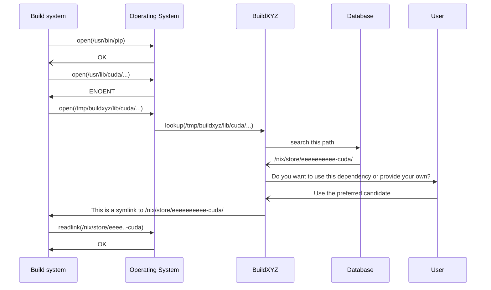

# `buildxyz`

Build your (Nix) package automatically.

## Introduction

`buildxyz` is a Rust program running your build system invocation and injecting into many commonly used environment variables extra search directories to trap
any filesystem access that cannot be provided by your existing environment.

By doing so, `buildxyz` can know what your build system needs and will provide it dynamically using the Nix store and a nixpkgs index database.

Finally, once your build system built, `buildxyz` remembers what it actually had to provide and can rematerialize the set of dependencies provided for any usage, e.g. providing this data to `nix-init` to automatically write a Nix derivation, fix implicit dependencies, etc.

## Design

`buildxyz` relies on [the FUSE technology](https://en.wikipedia.org/wiki/Filesystem_in_Userspace) to instantiate an instrumented filesystem which does not require any higher privilege.

Here is a sequence example of `buildxyz` operating:



## Actually implemented

BuildXYZ can already provide dependencies to your build system based on a precise revision of nixpkgs, pinned in the `default.nix`.

It is known to work on Python's packages (through `pip install --no-binary :all:`) and sometimes on certain autotools project depending on their complexity.

## Resolutions

When BuildXYZ receives a new filesystem access, it means that the existing environment failed to provide it.

If the filesystem access has a match in the nixpkgs index database, two options are possible:

- provide it
- do not provide it

We call resolution the information composed of a filesystem access identified by a canonical path and a decision: provide it or not.

Not all filesystem accesses should be provided even if we have matches for them, that's why we enable custom resolutions which can be managed through policies: user interaction, language-specific resolutions, etc.

The resolution data for a project is very interesting as it is exactly the "implicit dependencies" data that is required to build a project, which is often described through instructions.

## Goals & TODO

Current objective: get Nix to compile without any manually provided dependency using BuildXYZ.

- Proper restart & program lifecycle (Ctrl-C, SIGTERM)
- Proper discovery of existing resolutions databases
- Proper flags to record new resolutions or merge them in an existing file
- Human/machine-readable format for resolutions
- Extend graphs of dependencies with implicit dependencies
- `nix-init` integration

# Usage

Run the project:

``` nix
nix run github:RaitoBezarius/buildxyz
```

Build the project:

``` nix
nix build
```

Run all tests:

``` nix
nix flake check -L
```

Run formatters:

``` nix
nix fmt
```
